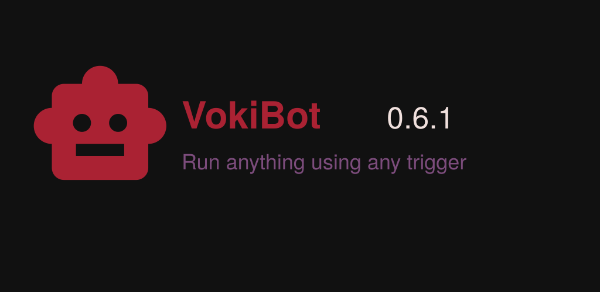
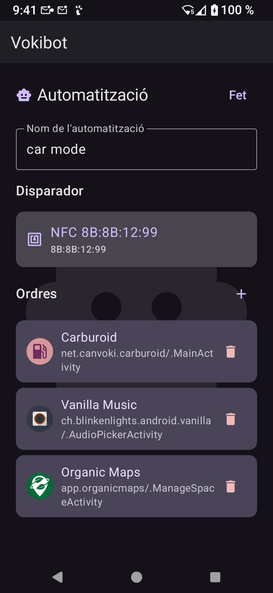
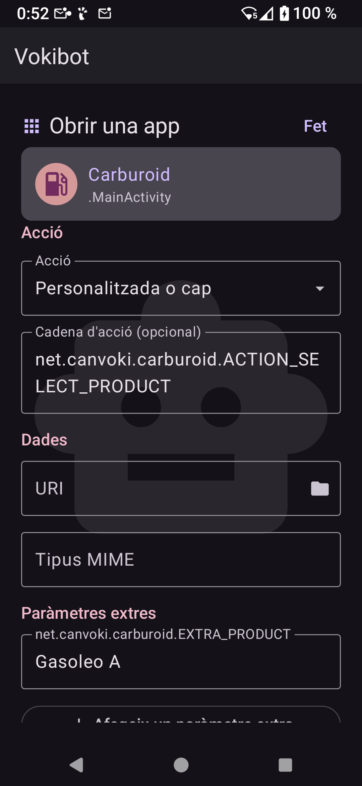
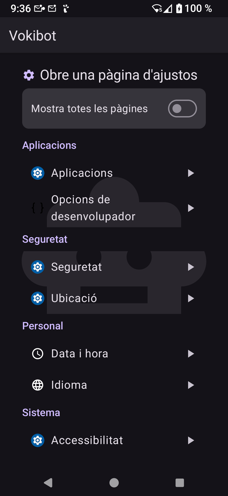
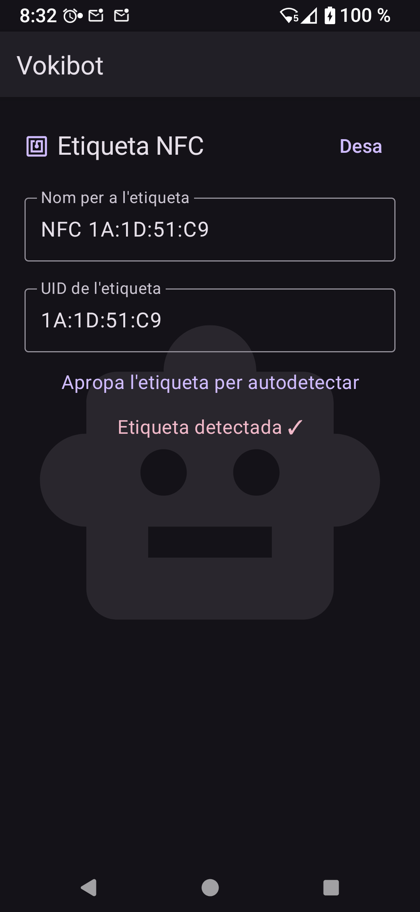

<!---->
<!---->

<!---->

# Voki Bot

Android automation tool

Makes you Android device perform actions (commands)
whenever something happens (triggers).

Implemented triggers:

- NFC tags (configure by tapping)
- Shortcuts (creates launcher icons)
- Bluetooth device (on connect to it)

Implemented commands:

- Activate application components (Activities, Services, Receivers)
- Open system configuration pages

<!-- end-of-description -->

## Screenshots

## License

Copyright © 2025-2026 David García Garzón

This program is free software: you can redistribute it and/or modify
it under the terms of the GNU Affero General Public License as published by
the Free Software Foundation, either version 3 of the License, or
(at your option) any later version.

This program is distributed in the hope that it will be useful,
but WITHOUT ANY WARRANTY; without even the implied warranty of
MERCHANTABILITY or FITNESS FOR A PARTICULAR PURPOSE.  See the
GNU Affero General Public License for more details.

You should have received a copy of the GNU Affero General Public License
along with this program.  If not, see <https://www.gnu.org/licenses/>.

